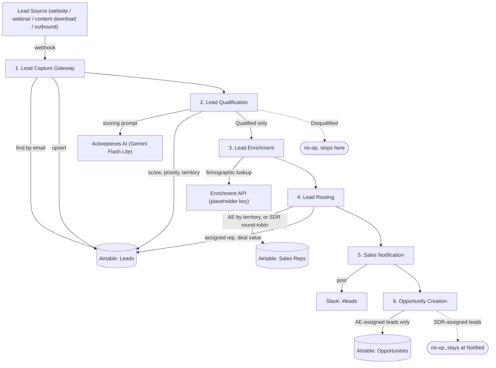

# Architecture

## System diagram

## Data flow, in order

1. **A lead enters the system** through Lead Capture Gateway's webhook (any source — website form, webinar signup, content download, manual entry).
2. **Lead Capture Gateway** validates required fields, then upserts the Leads table by email: existing contact → update contact info only (pipeline status untouched); new contact → create with `Status: New`.
3. **Lead Qualification** fetches the lead, sends job title/company/lead source/company size/industry to an LLM for a 0–100 fit score, then applies deterministic business rules on top: score → Priority tier (High/Medium/Low) and a Disqualified cutoff (<30); company size → Territory segment (Enterprise/Mid-Market/SMB), computed in code rather than left to the model.
4. **Disqualified leads stop here.** Only `Qualified` leads continue to Enrichment.
5. **Lead Enrichment** calls a firmographic API to fill in any gaps. This runs against a placeholder key in this build and is designed to **fail open** — a failed lookup flags `Enrichment Status: Failed` and the lead keeps moving, rather than blocking the pipeline on a missing vendor credential.
6. **Lead Routing** branches on Priority: `High` → assigned directly to the Account Executive who owns that lead's Territory (no SDR triage); `Medium`/`Low` → assigned via deterministic round-robin (hash of email) across the 5-person SDR pool. Also stamps a rough deal-value estimate by territory tier.
7. **Sales Notification** posts to Slack with the rep's name, lead context, score, and the AI's reasoning attached.
8. **Opportunity Creation** checks whether the assigned rep is an AE. If yes, creates an Opportunity record (Discovery stage, 45-day default close date) and marks the lead `Status: Opportunity`. If the lead went to an SDR instead, this workflow correctly does nothing — there's no deal to track until an AE picks it up.

## Why webhook-to-webhook chaining instead of one workflow

Each of the six stages above is a *separate* Activepieces flow with its own webhook trigger, wired together by having each workflow's final step call the next workflow's webhook. This is a deliberate structural choice — see [engineering-decisions.md](../docs/engineering-decisions.md#why-modular-workflows-instead-of-one-flow) for the full reasoning.

## Why query parameters, not a JSON body, for the handoff

Every inter-workflow HTTP call in this system passes its payload (just an email address — each workflow re-fetches the lead's current state itself rather than trusting a stale copy passed along the chain) as a **URL query parameter**, not a JSON request body. This was not the original design — see [troubleshooting.md](../docs/troubleshooting.md#inter-workflow-handoff-arrives-empty) for the real failure this fixes.
