# RevenuePilot OS

A 10-workflow B2B lead-to-cash automation system built on Activepieces, covering lead capture through customer onboarding, weekly revenue reporting, centralized error monitoring, and a natural-language revenue assistant.

## Portfolio highlights

- 10 production-tested Activepieces workflows, chained into one lead-to-cash pipeline
- AI-powered lead qualification and weekly-report narrative generation (OpenAI)
- Modular, webhook-to-webhook architecture — every workflow independently triggerable and testable
- Airtable CRM integration across leads, territory rules, CSM pool, and reporting
- Slack automation for lead alerts, onboarding announcements, and error escalation
- Gmail automation for onboarding welcome emails and failure escalation
- Centralized error monitoring and classification across all nine other workflows
- Scheduled weekly executive reporting with AI-generated narrative summaries
- Round-robin customer onboarding automation on Closed Won
- Full engineering documentation: architecture, setup, schema, troubleshooting, and decisions doc

## The problem

Most B2B teams below a certain size handle lead routing, qualification, and onboarding by hand: a form submission lands in an inbox, someone eyeballs it, manually checks for duplicates, decides who should own it, and pings the rep on Slack. This works until volume grows past a few dozen leads a week, at which point it becomes inconsistent — leads get missed, duplicate records pile up, routing depends on who's paying attention, and nobody can answer "how many qualified leads did we get last week?" without opening five different tools.

RevenuePilot OS automates the full lead lifecycle end to end: a lead enters the system once, and ten purpose-built workflows carry it through deduplication, enrichment, AI-assisted scoring, territory routing, notification, (on close-won) customer onboarding, and into a recurring revenue report — with a dedicated monitoring workflow watching for failures across all of it, and an on-demand assistant that can answer plain-English questions about the data.

## What it is not

This is not a CRM replacement. Airtable is the system of record here because it's fast to iterate on and free to run for a portfolio project — the same architecture maps cleanly onto Salesforce or HubSpot as the backing CRM (see [Future Improvements](#future-improvements)).

## Features

| # | Workflow | Trigger | Purpose | Business value |
|---|---|---|---|---|
| 1 | Lead Capture Gateway | Webhook | Normalizes and validates inbound leads from any source (website, Typeform, HubSpot, manual) | One consistent entry point regardless of lead source |
| 2 | Duplicate Detection | Webhook | Checks CRM by email, creates or updates accordingly | Prevents duplicate records and lost activity history |
| 3 | Lead Enrichment | Webhook | Looks up company size, industry, country from a firmographic data provider | Gives qualification and routing the context to work with |
| 4 | AI Lead Qualification | Webhook | Scores and prioritizes the lead using an LLM, with a safe fallback if the AI call fails | Consistent scoring without a human reviewing every lead |
| 5 | Territory Routing | Webhook | Applies ordered business rules to assign territory and rep pool | Deterministic, auditable routing instead of ad hoc assignment |
| 6 | Slack Notification System | Webhook | Notifies sales/founders/marketing channels based on score and source | Reps hear about hot leads in seconds, not hours |
| 7 | Customer Onboarding | Webhook (on Closed Won) | Round-robin CSM assignment, welcome email, checklist creation | New customers get a consistent, fast onboarding kickoff |
| 8 | Weekly Executive Report | Schedule (Mon 8am) | Computes leads/MQL/SQL/conversion/revenue metrics and an AI narrative summary | Leadership gets a standing report with no manual pull |
| 9 | Error Monitoring | Webhook (internal) | Classifies failures as retryable/fatal, logs, alerts, escalates | One place to see what's breaking across all nine other workflows |
| 10 | AI Revenue Assistant | Webhook | Converts a plain-English question into a validated, read-only data query | Ask "how many leads came from India this week" without opening Airtable |

## Workflow overview

### 1. Lead Capture Gateway
- **Trigger:** webhook, any lead source posts here
- **Steps:** detect source shape (website/Typeform/HubSpot/manual) → normalize fields → validate required fields and email format → branch valid/invalid → respond
- **External services:** none (pure normalization)
- **Result:** a clean, source-agnostic lead object handed to Duplicate Detection

### 2. Duplicate Detection
- **Trigger:** webhook, `{ lead }`
- **Steps:** find existing CRM record by email → branch create/update → write to Airtable → forward to Enrichment
- **External services:** Airtable
- **Result:** exactly one CRM record per email, activity preserved on repeat contact

### 3. Lead Enrichment
- **Trigger:** webhook, `{ crmRecord }`
- **Steps:** extract domain → call firmographic data provider → branch success/incomplete → update CRM → forward to Qualification
- **External services:** third-party enrichment API (placeholder key in this build — see [Setup](docs/setup.md))
- **Result:** company size, industry, and country attached to the record when available; the record is never blocked on this failing

### 4. AI Lead Qualification
- **Trigger:** webhook, `{ crmRecord }`
- **Steps:** build a scoring prompt from the enriched record → call OpenAI → on failure, fall back to a safe default score/priority → update CRM → forward to Routing
- **External services:** OpenAI (placeholder key in this build)
- **Result:** every lead gets a Lead Score, Priority, and AI Reasoning — even when the AI call fails

### 5. Territory Routing
- **Trigger:** webhook, `{ crmRecord }`
- **Steps:** fetch active territory rules ordered by priority → evaluate top-to-bottom, first match wins → fall back to `unassigned`/`sdr_pool` → update CRM → forward to Notification
- **External services:** Airtable (Territory Rules table)
- **Result:** deterministic assignment that's auditable against a rules table, not tribal knowledge

### 6. Slack Notification System
- **Trigger:** webhook, `{ crmRecord, territory, repPool }`
- **Steps:** build the notification message(s) → loop and send to the relevant channel(s) (sales always; founders if score ≥ 80; marketing if source is inbound-organic)
- **External services:** Slack
- **Result:** the right people find out about a lead within seconds of it entering the system

### 7. Customer Onboarding
- **Trigger:** webhook, `{ crmRecord }` (fired when a deal is marked Closed Won)
- **Steps:** create onboarding checklist row → fetch active CSM pool → round-robin assign by fewest open onboardings → increment CSM's count → send welcome email → post to Slack → update CRM
- **External services:** Airtable, Gmail, Slack
- **Result:** every new customer gets a CSM and a welcome email without anyone remembering to do it manually

### 8. Weekly Executive Report
- **Trigger:** schedule, every Monday 8am
- **Steps:** fetch all leads → compute previous Mon–Sun window metrics (leads, MQLs, SQLs, conversion rate, revenue, lost deals) → generate an AI narrative summary → archive to a Reports table → post to Slack
- **External services:** Airtable, OpenAI, Slack
- **Result:** a standing weekly report with no manual data pull

### 9. Error Monitoring
- **Trigger:** webhook, called by any other workflow's failure handling, `{ flowName, stepName, error, payload, retryCount }`
- **Steps:** classify retryable vs. fatal → log to a Failures table → alert Slack → escalate via email if not retryable or retries exhausted
- **External services:** Airtable, Slack, Gmail
- **Result:** one centralized place to see and be alerted to failures across the whole system

### 10. AI Revenue Assistant
- **Trigger:** webhook, `{ question }`
- **Steps:** translate the question into a validated, read-only query (allowlisted tables, SELECT-only semantics) → execute → generate a plain-English explanation of the result
- **External services:** Airtable, OpenAI
- **Result:** answer data questions without writing a query or opening a spreadsheet

## Architecture

See [architecture/architecture.md](architecture/architecture.md) for the full system diagram and data flow.

At a high level:

```
Lead Source → Webhook → Lead Capture → Duplicate Detection → Enrichment
  → AI Qualification → Territory Routing → Slack Notification
       ↓ (on Closed Won)
  Customer Onboarding → (Airtable / Gmail / Slack)

Weekly schedule → Weekly Executive Report → (Airtable / OpenAI / Slack)

Any workflow failure → Error Monitoring → (Airtable / Slack / Gmail)

On-demand question → AI Revenue Assistant → (Airtable / OpenAI)
```

Each workflow is independently triggerable via its own webhook and independently testable — the pipeline is wired by having each workflow call the next one's webhook on success, rather than being one monolithic flow. This keeps each workflow's contract explicit and lets any one of them be tested, replayed, or modified without touching the others.

## Tech stack

| Technology | Why |
|---|---|
| **Activepieces** | Open-source, self-hostable automation platform with a visual builder and native code steps when logic needs more than a drag-and-drop action. Chosen over n8n/Zapier/Make for its combination of a generous free cloud tier, first-class custom-code steps, and straightforward webhook-to-webhook chaining, which is what this project's inter-workflow architecture depends on. |
| **Airtable** | Zero-cost, zero-infrastructure relational store with a real REST API, sufficient for this project's data volume and portfolio purpose. A production deployment at scale would move this to Postgres or the team's existing CRM (see [Future Improvements](#future-improvements)). |
| **Gmail** | Free, reliable transactional email for welcome messages and escalation alerts; the same connector pattern works with any transactional email provider. |
| **Slack** | The de facto standard for internal team notifications; used here for lead alerts, onboarding announcements, and error escalation. |
| **OpenAI** | Used for lead qualification scoring, weekly report narrative summaries, and natural-language-to-query translation. All three integration points are built with real API call structure, retry-aware error handling, and safe fallbacks — they run against a placeholder key in this build (see [Setup](docs/setup.md)) but require no code changes to go live with a real key. |

## Installation

See [docs/setup.md](docs/setup.md) for the full setup guide, including required accounts, connections, environment/credential setup, Airtable base creation, workflow import order, and activation sequence.

## Repository layout

```
RevenuePilot-OS/
├── README.md                    — this file
├── LICENSE
├── CHANGELOG.md
├── .gitignore
├── workflows/                   — exported Activepieces flow JSON, one per workflow
├── screenshots/
│   └── workflow/                — clean canvas screenshots of each workflow
├── payloads/                    — example request/response payloads, captured from real executions
├── architecture/
│   └── architecture.md          — system diagram and data flow
└── docs/
    ├── setup.md                 — deployment guide
    ├── engineering-decisions.md — why, not just what
    ├── airtable-schema.md       — every table and field
    └── troubleshooting.md       — known failure modes and fixes
```

## Screenshots

Canvas screenshots for all 10 workflows are in [`screenshots/workflow/`](screenshots/workflow/):

| Workflow | Canvas |
|---|---|
| 1. Lead Capture Gateway | 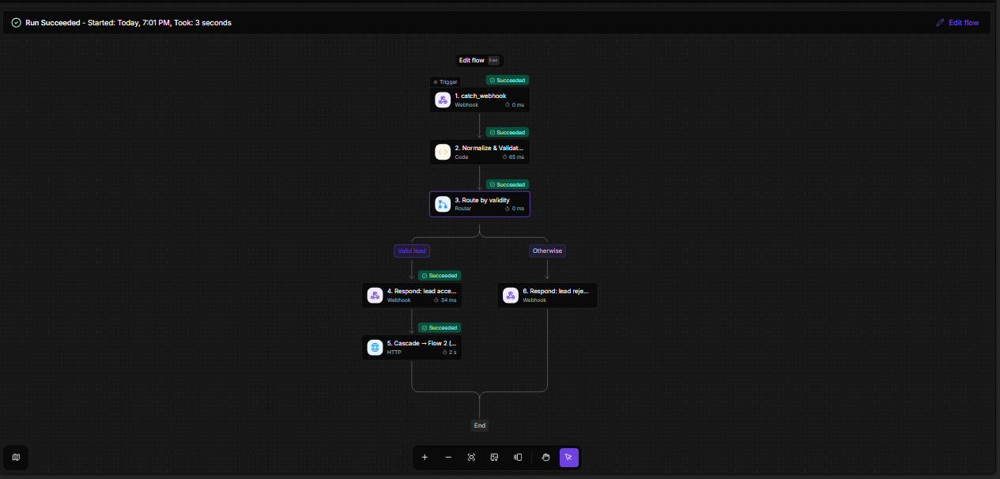 |
| 2. Duplicate Detection | 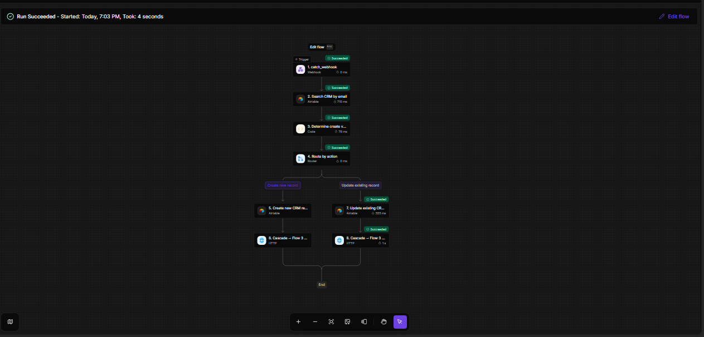 |
| 3. Lead Enrichment | 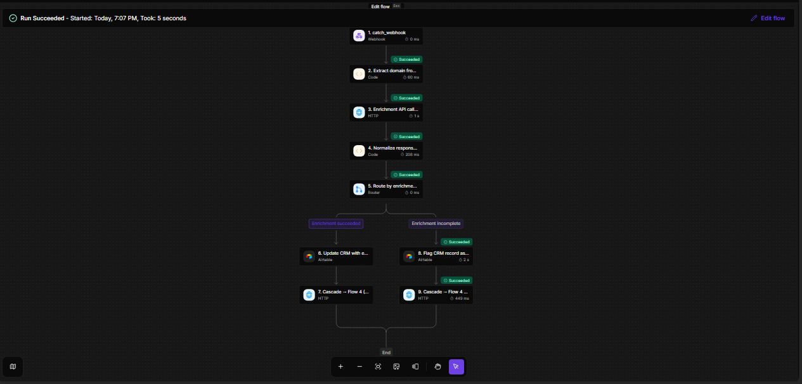 |
| 4. AI Lead Qualification | 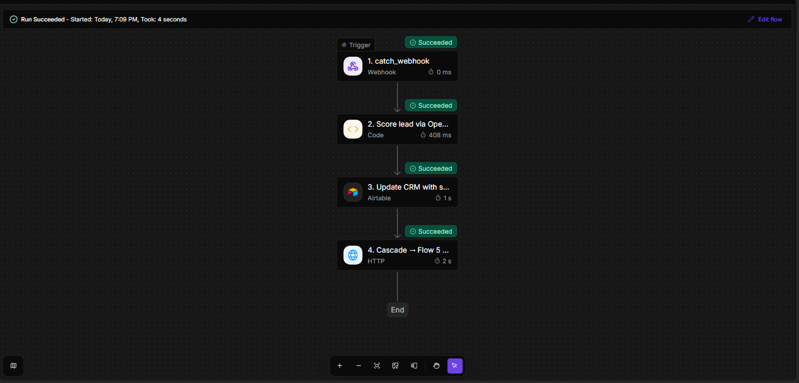 |
| 5. Territory Routing | 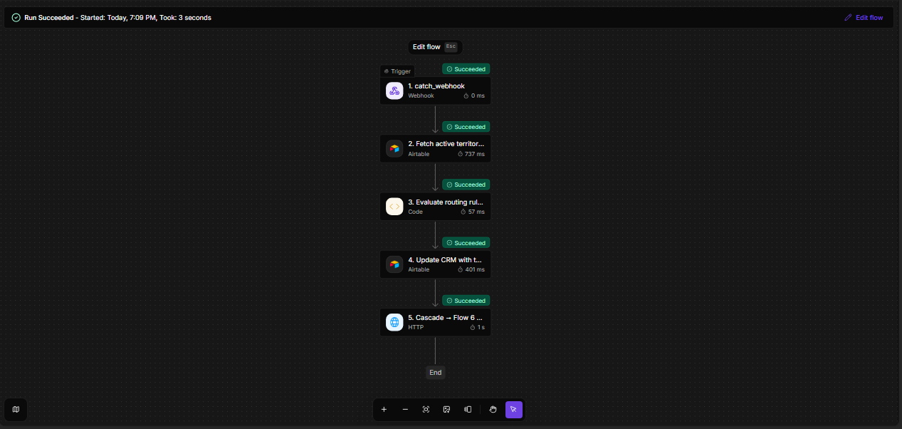 |
| 6. Slack Notification System | 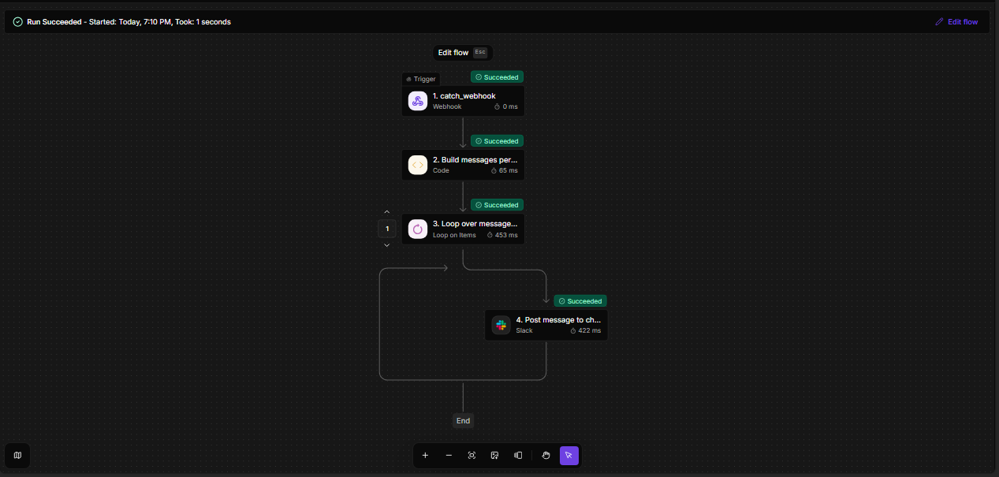 |
| 7. Customer Onboarding | 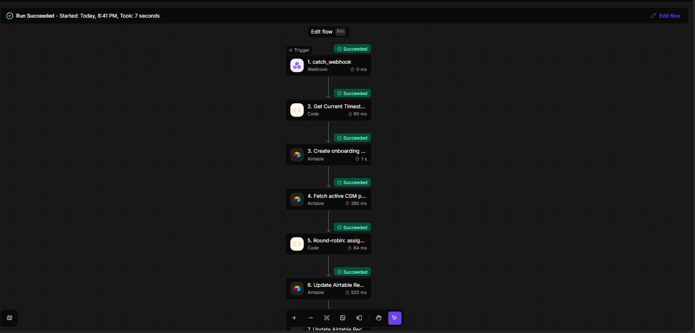 · 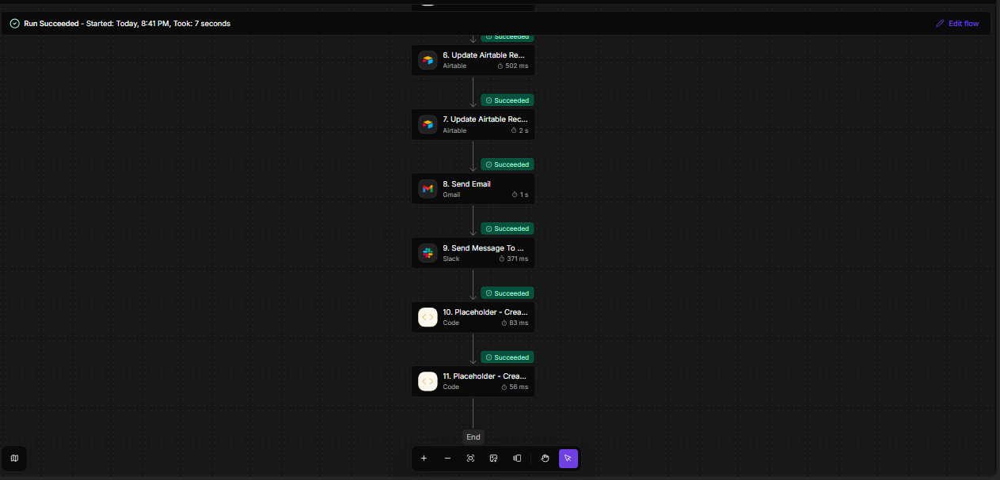 |
| 8. Weekly Executive Report | 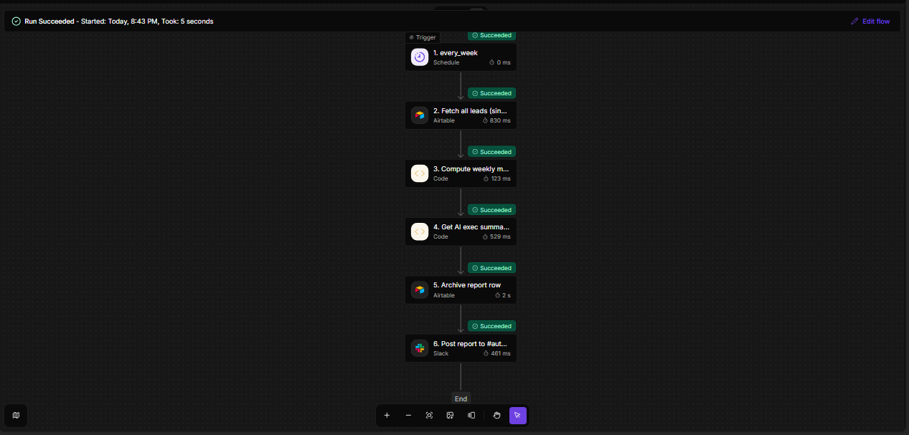 |
| 9. Error Monitoring | 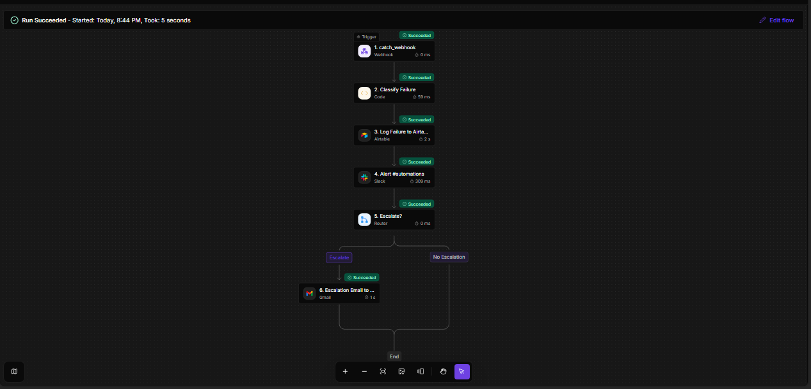 |
| 10. AI Revenue Assistant | 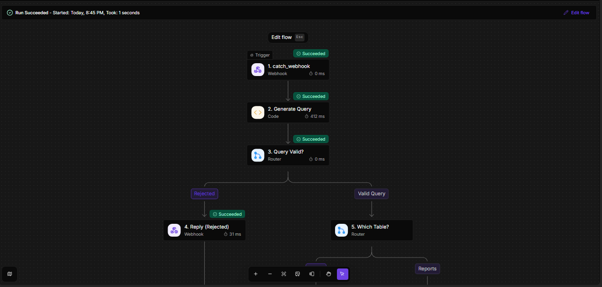 · 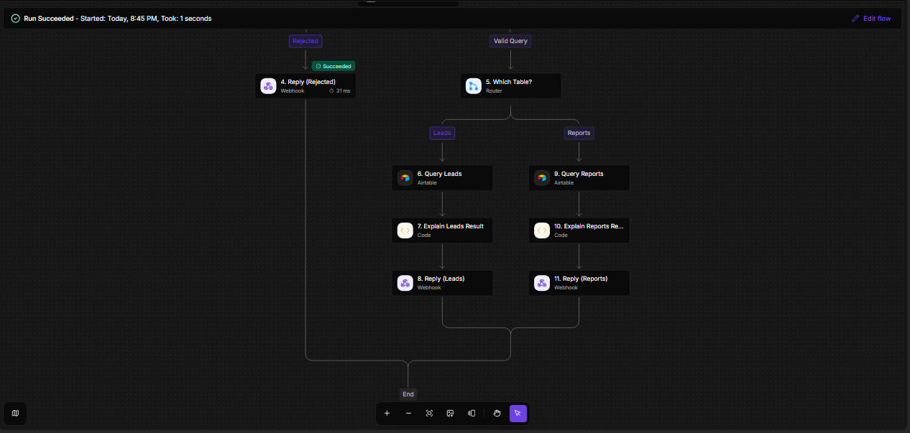 |

Execution-trace screenshots (step-by-step input/output for a live run of each workflow) aren't included in this release — planned for a follow-up update.

## Payload examples

Example payloads in [`/payloads`](payloads/) are captured from real executions run against this project's live Activepieces instance during development and testing — not hand-written. See each file's header comment for the specific execution it was captured from.

## Lessons learned

- **Idempotency and duplicate prevention:** the Duplicate Detection workflow exists specifically because webhook-triggered pipelines will see the same lead more than once (retries, re-submissions, multi-channel capture of the same contact). Keying on email and branching create-vs-update, rather than always inserting, is what keeps the CRM from filling with duplicate rows.
- **Round-robin routing needs a source of truth for load, not just identity:** the onboarding CSM assignment tracks each CSM's *current open count* and picks the minimum — a naive round-robin (just cycling through a list) breaks the moment someone goes on leave or gets manually reassigned extra accounts.
- **Error handling has to be additive, not blocking:** every workflow in this system treats third-party API failures (enrichment, AI scoring) as expected, not exceptional — each has an explicit fallback path so one vendor's downtime doesn't stall the whole pipeline. The Error Monitoring workflow exists to surface these failures for a human, not to prevent them from happening.
- **Workflow modularity over one giant flow:** each of the ten workflows has its own webhook and can be tested, triggered, and debugged independently. The cost is that data has to be explicitly re-sent between them (see the field-naming consistency note in [engineering-decisions.md](docs/engineering-decisions.md)) — the benefit is that no single workflow's complexity becomes unmanageable, and a bug in one doesn't require redeploying all ten.
- **Observability has to be deliberate:** a distributed pipeline with ten independently-triggered workflows has no single "flow succeeded" signal the way a monolith does. Workflow 9 (Error Monitoring) is what gives this system a single place to look when something goes wrong, instead of having to check ten separate execution histories.

## Future improvements

- **Real CRM integration** — swap Airtable for HubSpot or Salesforce as the system of record; the workflow logic (dedup by email, field updates, status transitions) maps directly onto either.
- **Retry queues / dead-letter queues** — the current retry logic (see Error Monitoring) is caller-side and single-attempt-then-log; a proper retry queue would decouple retry timing from the calling workflow's own execution.
- **Secrets management** — API keys are currently placeholder values wired into workflow code steps; a production deployment would pull these from a secrets manager rather than embedding them in workflow configuration.
- **Monitoring/alerting beyond Slack** — Error Monitoring currently escalates via Slack and email; a production system at higher volume would benefit from a proper on-call/paging integration (PagerDuty, Opsgenie).
- **Authentication on inbound webhooks** — the lead-capture and inter-workflow webhooks are currently unauthenticated by design (simplifies the portfolio build); production webhooks should validate a shared secret or signature.
- **Rate limiting** — none of the ten workflows currently rate-limit inbound traffic; a public-facing lead-capture endpoint should have this in front of it.
- **Pagination on the reporting and assistant queries** — Weekly Executive Report and the AI Revenue Assistant currently fetch a single page (up to 100 records); this is a known scaling limit once the Leads table exceeds that.

## Changelog

See [CHANGELOG.md](CHANGELOG.md).

## License

See [LICENSE](LICENSE).
