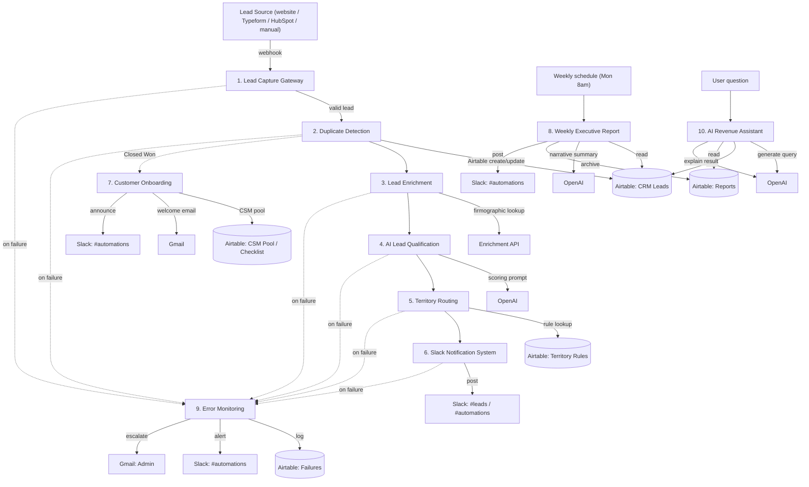

# Architecture

## System diagram

## Data flow, in order

1. **Lead enters the system** through any source (a web form, Typeform, HubSpot, or a manual entry), all normalized into one shape by Lead Capture Gateway.
2. **Duplicate Detection** looks the contact up by email in the CRM. New contact → create. Existing contact → update, preserving history instead of creating a second record.
3. **Lead Enrichment** attaches firmographic data (company size, industry, country) from a third-party provider. Failure here is expected and handled — the record is flagged `Enrichment Incomplete` and continues rather than blocking the pipeline.
4. **AI Qualification** scores the lead and assigns a priority using an LLM prompt built from whatever data is available (enriched or not). On AI failure, a safe default (score 0, priority medium) is used instead of blocking.
5. **Territory Routing** evaluates an ordered rules table (company size, location, etc.) and assigns a territory and rep pool. No matching rule → falls back to an unassigned/SDR pool rather than failing.
6. **Slack Notification** tells the right channels: sales always, founders for high scores, marketing for inbound-organic sources.
7. **Customer Onboarding** fires separately, only when a deal is marked Closed Won — not part of the automatic new-lead cascade above. It round-robins a Customer Success Manager by current open-account load, creates a checklist, sends a welcome email, and announces the new customer.
8. **Weekly Executive Report** runs on a schedule (not lead-triggered), independently computing the previous week's funnel metrics and revenue, summarizing them with an LLM, archiving the result, and posting it to Slack.
9. **Error Monitoring** is called by any of the other workflows' failure-handling logic, not chained into the success path. It classifies whether a given failure is retryable, logs it, alerts the team, and escalates by email if the failure is fatal or retries are exhausted.
10. **AI Revenue Assistant** runs on-demand, translating a plain-English question into a validated, read-only query against the CRM and reports data, then explaining the result in plain English.

## Why webhook-to-webhook chaining instead of one workflow

Workflows 1 through 6 form a logical pipeline, but each is a *separate* Activepieces flow with its own webhook trigger, wired together by having each workflow's final step call the next workflow's webhook. This is a deliberate structural choice — see [engineering-decisions.md](../docs/engineering-decisions.md#why-modular-workflows-instead-of-one-flow) for the full reasoning.
